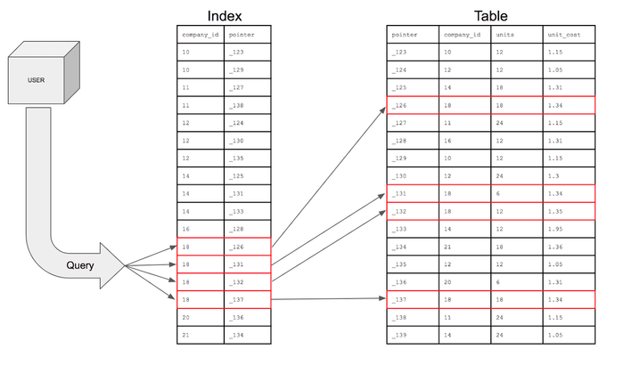

# 2주차 키워드

## 데이터베이스 정규화

"**데이터의 중복을 제거하는 정리정돈 과정**" 

**정의**: 관계형 데이터베이스에서 데이터의 중복을 최소화하고 데이터의 일관성과 무결성을 확보하기 위해, 테이블을 논리적으로 분해하는 과정.
이 과정을 통해 데이터 삽입, 수정, 삭제 시 발생할 수 있는 이상 현상을 방지

- **1차 정규형 (1NF)**: 테이블의 모든 컬럼 값이 원자값인 더 이상 쪼갤 수 없는 단일 값을 갖도록 하는 것.
- **2차 정규형 (2NF)**: 1차 정규형을 만족하고, 부분 함수 종속성을 제거하는 과정. 
복합키의 일부에만 종속되는 컬럼을 별도의 테이블로 분리.
- **3차 정규형 (3NF)**: 2차 정규형을 만족하고, 이행 함수 종속성을 제거하는 과정.
기본키가 아닌 다른 일반 컬럼에 종속되는 컬럼을 별도의 테이블로 분리.

**장점**: 데이터 중복이 줄어들어 저장 공간이 절약되고, 데이터 무결성이 향상되어 데이터 관리가 용이.
**단점**: 테이블이 여러 개로 분해되면서, 데이터 조회 시 더 많은 Join이 필요해져 성능이 저하될 수 있음.

## 인덱스(Index)

"**데이터베이스의 '찾아보기' 페이지**" 

**정의**: 테이블에서 데이터 SELECT 속도를 획기적으로 향상시키기 위해 사용하는 자료구조.
원하는 데이터가 실제 어디에 저장되어 있는지에 대한 위치 정보를 가지고 있음.

- **동작 원리**: 인덱스는 특정 컬럼의 값과 해당 값이 저장된 행의 위치(주소)를 키-값 쌍으로 저장. WHERE 절 등으로 특정 데이터를 찾을 때, 테이블 전체를 스캔하지 않고 인덱스를 먼저 참조하여 데이터 위치로 빠르게 이동.

**장점**: 데이터 검색 및 조회 속도가 매우 빨라짐.

**단점**:

- **추가 저장 공간**: 인덱스를 생성하면 별도의 저장 공간이 필요함.
- **성능 저하**: 데이터의 삽입(INSERT), 수정(UPDATE), 삭제(DELETE) 시 인덱스 테이블도 함께 업데이트해야 하므로 쓰기 작업의 성능이 저하될 수 있음. 따라서 검색이 잦은 컬럼에만 적용 권장.

## ORM VS Raw SQL

| 구분 | Object-Relational Mapping | Raw SQL |
| :--- | :--- | :--- |
| **개념** | 객체(Object)와 데이터베이스를 연결하는 번역기 | 데이터베이스와 직접 대화하는 언어 |
| **정의** | 객체지향 프로그래밍 언어의 객체와 데이터베이스 테이블을 자동으로 연결해주는 기술 | 개발자가 직접 SQL 쿼리문을 작성하여 데이터베이스를 조작 |
| **장점** | 1. **생산성 향상**: SQL을 몰라도 객체 메서드를 통해 DB 조작이 가능해 개발 속도가 빠름 2. **유지보수 용이**: SQL 종속성이 낮아 DB를 변경해도 코드 수정이 적음 3. **가독성**: 코드가 직관적이고 비즈니스 로직에 집중할 수 있음 | 1. **최고의 성능**: 가장 최적화된 쿼리를 직접 작성할 수 있어 성능이 뛰어남 2. **유연성**: 복잡하고 섬세한 쿼리, 특정 DB에만 있는 기능 등을 자유롭게 사용할 수 있음 |
| **단점** | 1. **성능 문제**: 자동 생성되는 쿼리가 비효율적일 수 있어 성능 저하의 원인이 되기도 함 2. **학습 곡선**: ORM 자체의 동작 방식과 개념을 별도로 학습해야함 3. **제한성**: 복잡한 쿼리는 ORM만으로 구현하기 어렵거나 불가능할 수 있음 | 1. **생산성 저하**: 반복적인 CRUD 쿼리를 모두 직접 작성해야함 2. **유지보수 어려움**: DB 변경 시 관련된 모든 SQL문을 직접 수정해야함 3. **보안 위험**: SQL 인젝션과 같은 보안 공격에 취약할 수 있어 주의가 필요 |